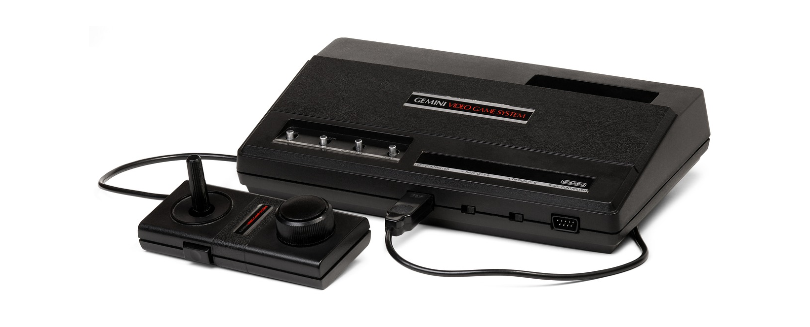

# Descente produit basique avec rawg.io
 

 

### Réaliser un prototype de site e-commerce (visualisation produit et navigation catégorie) en consommant des api externes.

## Ressource(s)

[une ressource sur fetch complémentaire à la doc officielle](https://www.pierre-giraud.com/javascript-apprendre-coder-cours/api-fetch/)

## Contexte du projet

`Vous travaillez pour une agence web.`

Votre product owner a été contacté par le service commercial. Un client (qui fait habituellement plutôt dans la chaussure) a découvert quatre containers de boites anciennes de jeux vidéos dans un entrepôt qu’il a acheté. Avec la mode du vintage et du rétro gaming, il a décidé de les vendre en ligne.

Dans un premier temps, le client souhaite voir un simple prototype que vous aurez la charge de réaliser. Le client ne dispose pas encore d’une base de données, des intérimaires sont en train de réaliser l’inventaire des boîtes.

Pour simuler la navigation, votre PO souhaiterait que vous récupériez des données sur une api publique. Il s’est mis d’accord avec le client, ce sera avec l’api [RAWG](https://rawg.io/apidocs) . Les jeux de l’api n’ont rien à voir avec les siens, qu’importe. Il veut juger le savoir-faire et la réactivité de l’agence.

Le client souhaite une navigation simple en mode SPA (monopage) dynamique et sans chargement.

Le client voudrait une descente produit classique. On accède à une liste de jeux videos à partir d’une liste de genres. En cliquant sur le jeu dans la liste, on affiche dans la page le détail du jeu.

Le PO vous encourage à rajouter des fonctionnalités notamment de filtrage si vous trouvez celà pertinent.

Le client voudrait le prototype dans trois jours. S’il vous reste du temps, il aimerait également que vous implémentiez un système simple de login et de reviews sur les jeux. Il n’aime pas du tout le système de review de l’api qu’il a qualifié d’usine à gaz. Une autre api pour déposer des reviews sera bientôt en ligne.

Les fonctions de prix, de panier et de paiement ne sont pas inclus dans le prototype.

Le PO souhaiterait que l’aspect visuel soit soigné. Le client veut quelque chose de “coloré et très graphique” mais la simplicité d’utilisation prime.

La maquette sera validée en amont avec le PO.

Le client voudrait que vous réalisez un diagramme des cas d’utilisation pour le donner à son service de gestion informatique.

L'agence utilise le framework next.js, vous développerez le prototype dans cette technologie.

## Modalités pédagogiques

<ul>
<li>Utilisation du framework next.js</li>
<li>durée : trois jours</li>
<li>utilisation de fetch ou axios</li>
</ul>

## Critères de performance
Navigation simple et fluide
réactivité de l'interface
soin graphique
respect des demandes clients

## Modalités d'évaluation
Démo au PO, analyse du code

## Livrables
lien vers le github du prototype, maquette, diagramme des use case